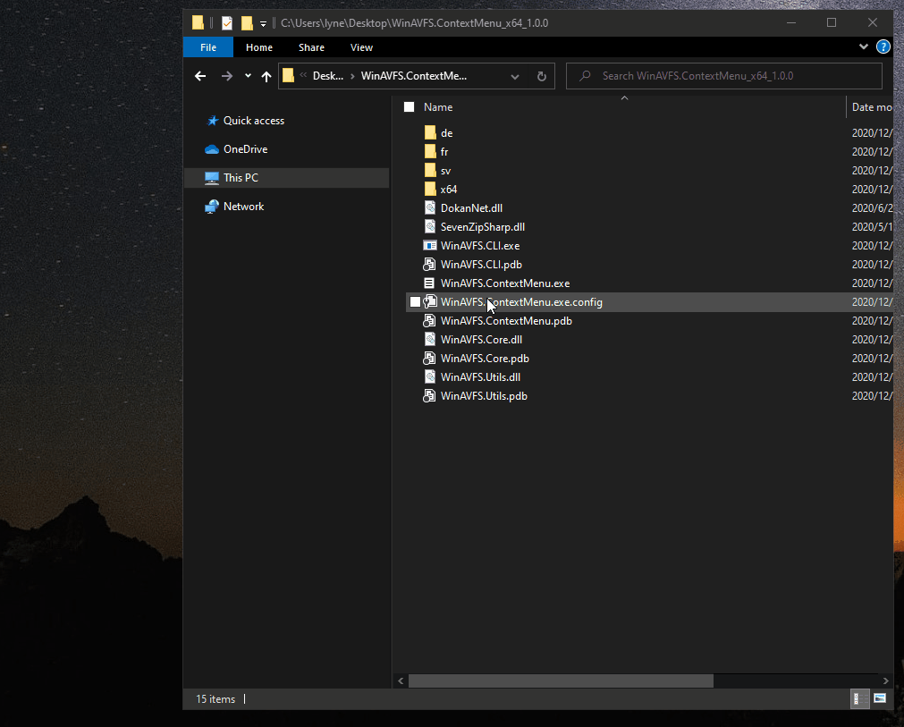
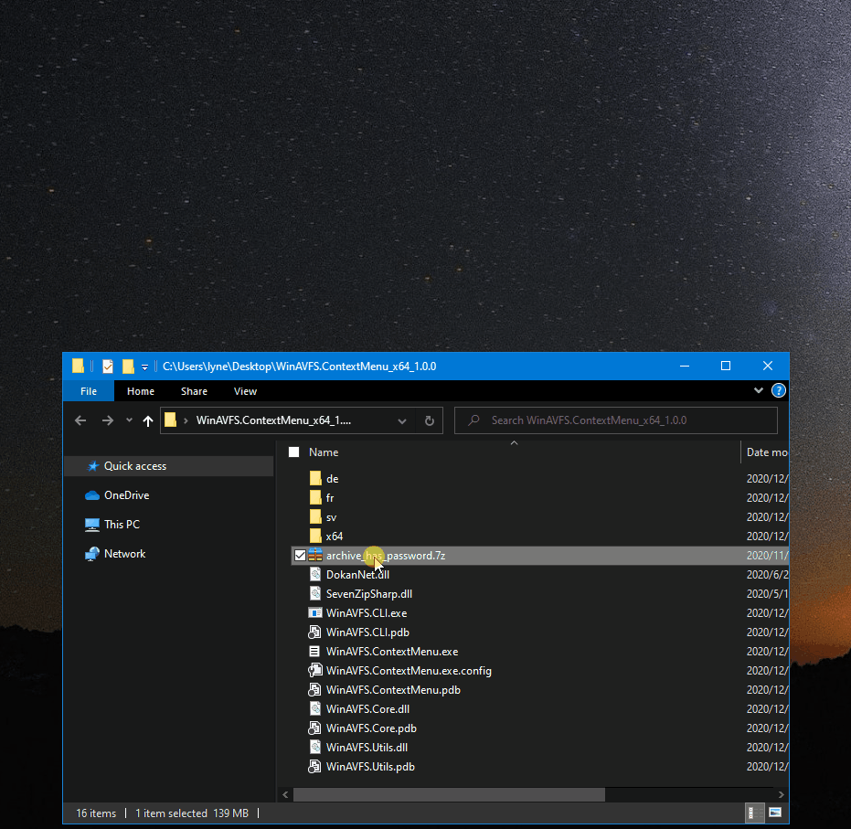

# WinAVFS.ContextMenu by lyne408

Sorry for combining Chinese Docs and English Docs in one document.

抱歉使用中英双语.

## What is WinAVFS

WinAVFS is an archive mounter. [Original WinAVFS](./README_by_Original_Author.md)

WinAVFS: 压缩文件挂载器. 可将压缩文件挂在到某个目录, 或者挂载为虚拟磁盘.

## Usage 使用

### Add explorer context menu 添加右键菜单

Run WinAVFS.ContextMenu.exe as administrator, click "Register" to add explorer context menu, or "Unregister" to remove. If successful, it will add a context menu item "Mount by WinAVFS" to all files.

以管理员身份运行 WinAVFS.ContextMenu.exe, 点击 "Register" 添加右键菜单, 或点击 "Unregister" 移除. 如果成功, 会对所有文件添加右键菜单 "Mount by WinAVFS".





### type password 输入解压密码

If the archive is encrypted, this program will open a dialog which has a password textbox, press "Enter" to load password.

如果该压缩文件包含密码, 挂载前会弹出一个对话框, 输完密码后, 按 "Enter" 键即可.





### CLI arguments

Usage: `WinAVFS.CLI.exe <path=archive_path> [password=password_string] [mount_point=mount_path]`

Example: 
```bat
WinAVFS.CLI.exe "path=D:\test.7z" "password=0123" "mount_point=D:\test"
```


## New Features 添加的功能

- **Default mount point 默认挂载点**

	Original CLI program won't create an empty directory before mounting, but this will. If not specify the "mount_point" argument, before mounting, by default, this program will create a empty directory or use existant empty directory, this suffix of that directory's name is "_\[WinAVFS\]" and prefix is the archive's name. 
	
	DeepQA 的原始程序挂载前不会自动创建挂载的文件夹, 此程序会. 默认的文件夹名, 前缀是压缩文件名, 后缀是"_\[WinAVFS\]".

- **context menu support 右键菜单**

	Add context menu to all files.
	Not COM, just add registry to "\*"(all file types).
	
	可添加右键菜单至所有文件. 非 COM, 仅操作注册表.

- **Password support 密码支持**
	
	Use GUI to type password, not CLI.
	
	可使用密码框输入密码, 而不是命令行界面.
	
- **eye-friendly CLI arguments**

	Original CLI arguments format:
	```bat
	:: password not support
	WinAVFS.CLI.exe D:\test.7z D:\test
	```
	
	New CLI arguments format:
	```bat
	WinAVFS.CLI.exe "path=D:\test.7z" "password=0123" "mount_point=D:\test"
	```

## Tips 提示

- **Don't mount large archive, especially encrypted. 不要挂载大文件, 特别是加密的.**

	Because WinAVFS use memory file system.
	
	因为 WinAVFS 使用内存文件夹系统.

- 为了性能, 使用 "存储" 级别的压缩. 使用 compact.exe(文件系统层级的压缩) 减少文件占用的空间.

- 可能无法挂载 .iso, 似乎 DokanNet 不支持这种文件系统. 

	挂载 Windows 10 官方镜像,  cn_windows_10_business_editions_version_2004_updated_sep_2020_x64_dvd_7134ba4b.iso 时, 遇到问题.
	7-Zip.exe 程序可以正常打开.
	
	挂载后, 其中有 README.txt, 内容如下:
	```text
	This disc contains a "UDF" file system and requires an operating system
	that supports the ISO-13346 "UDF" file system specification.
	```
	
	
- 对于 `.tgz` 这种双重压缩的, 一般来没有必要挂载, 所以不单独处理双重压缩的.